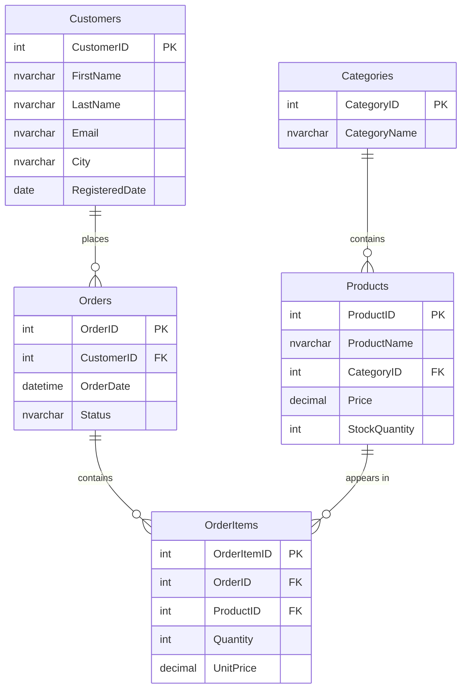

# E-Commerce Database (Microsoft SQL Server)

A relational database project designed for a simple online store. It demonstrates
schema design, relational integrity (foreign keys and check constraints), sample
data, reporting queries, and T-SQL objects such as views, stored procedures, and
triggers.

## Contents

| File | Description |
|------|-------------|
| `scripts/01_schema.sql` | Database and table creation, constraints, and indexes |
| `scripts/02_sample_data.sql` | Sample data to populate the tables |
| `scripts/03_queries.sql` | Reporting queries with JOIN, GROUP BY, and subqueries |
| `scripts/04_views_procedures.sql` | View, stored procedure, and trigger examples |

## Data Model



The `OrderItems` table is the junction table that resolves the many-to-many
relationship between `Orders` and `Products`. The price at the time of the order
(`UnitPrice`) is stored here, so historical orders are unaffected even if a
product's price changes later.

## Concepts demonstrated

- Table design, primary / foreign keys, auto-incrementing keys with `IDENTITY`
- Data integrity through `CHECK`, `UNIQUE`, and `DEFAULT` constraints
- `INNER JOIN` / `LEFT JOIN`, `GROUP BY`, aggregate functions (`SUM`, `COUNT`, `AVG`)
- Subqueries and filtering with `NOT EXISTS`
- Reusable queries via `VIEW`
- Parameterized `STORED PROCEDURE` (including stock checks)
- Automatic stock updates with an `AFTER INSERT` trigger (multi-row insert safe)
- Indexes on frequently queried columns

## Running

In SQL Server Management Studio (SSMS) or Azure Data Studio, run the scripts **in order**:

1. `01_schema.sql`
2. `02_sample_data.sql`
3. `04_views_procedures.sql`
4. Run any query you like from `03_queries.sql`

From the command line with `sqlcmd`:

```bash
sqlcmd -S localhost -i scripts/01_schema.sql
sqlcmd -S localhost -i scripts/02_sample_data.sql
sqlcmd -S localhost -i scripts/04_views_procedures.sql
```

## Example usage

```sql
-- View order summaries
SELECT * FROM dbo.vw_OrderSummary ORDER BY OrderTotal DESC;

-- Orders for a specific customer
EXEC dbo.usp_GetCustomerOrders @CustomerID = 1;

-- Add a new order item with a stock check (stock is reduced automatically by the trigger)
EXEC dbo.usp_AddOrderItem @OrderID = 1, @ProductID = 2, @Quantity = 1;
```

## Possible improvements

- A denormalized column storing the order total, plus a trigger to keep it updated
- Adding address and payment tables
- More comprehensive business rules that block orders when stock is insufficient
